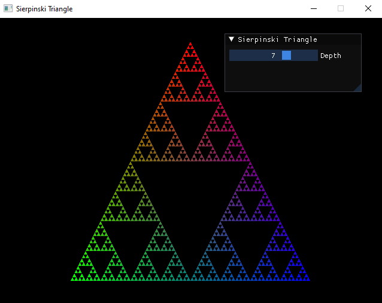

Sierpinski
==========



Sierpinski triangles are a type of fractal that are based on the
[Sierpinski triangle](https://en.wikipedia.org/wiki/Sierpinski_triangle). They are created by recursively subdividing a triangle into smaller triangles.

The algorithm is as follows:
    1. Start with a triangle.
    2. Divide the triangle into three triangles.
    3. Repeat step 2 for each triangle.

Build instructions
==================

The repo provides a CMake script to build the program, which uses [vcpkg](https://github.com/microsoft/vcpkg) to get the dependencies. The program needs the following dependencies:
    1. [SDL2](https://github.com/libsdl-org/SDL) (>= 2.0.18)
    2. [Dear ImGui](https://github.com/ocornut/imgui) (>= 1.85)

First make sure you have installed vcpkg, CMake and have a working C++20 compiler. Then, run the following commands:
```bash
    # Outside of the repo
    vcpkg install sdl2 imgui
    # Inside the repo
    mkdir build
    cd build
    cmake ..
    # Build
    cmake --build .
```